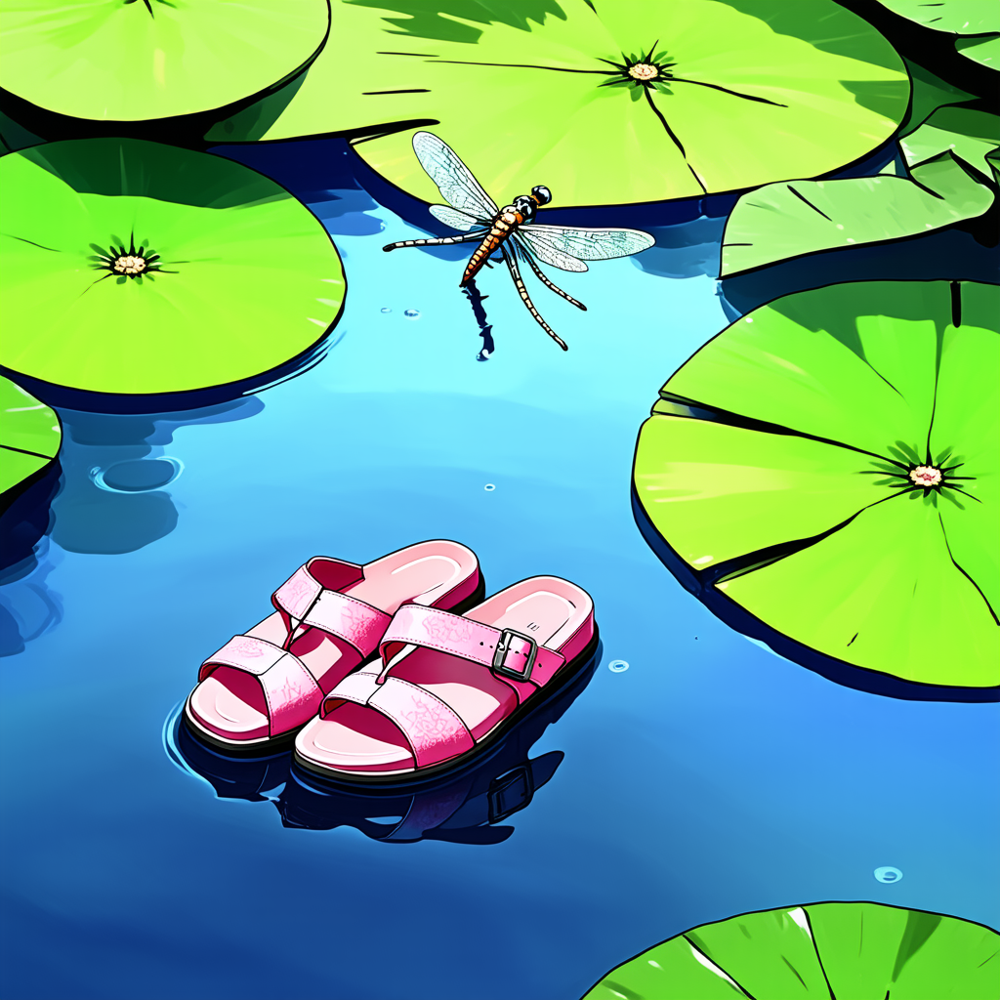
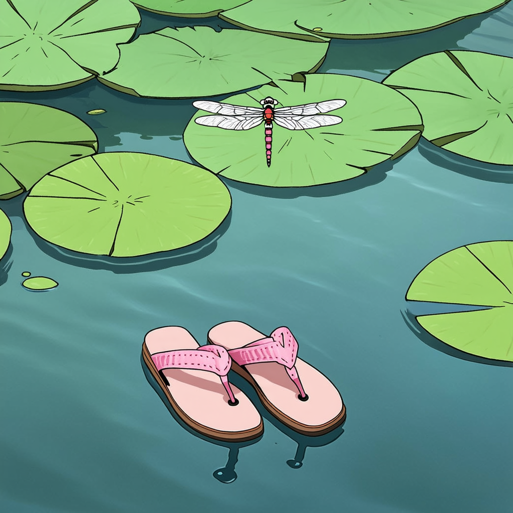
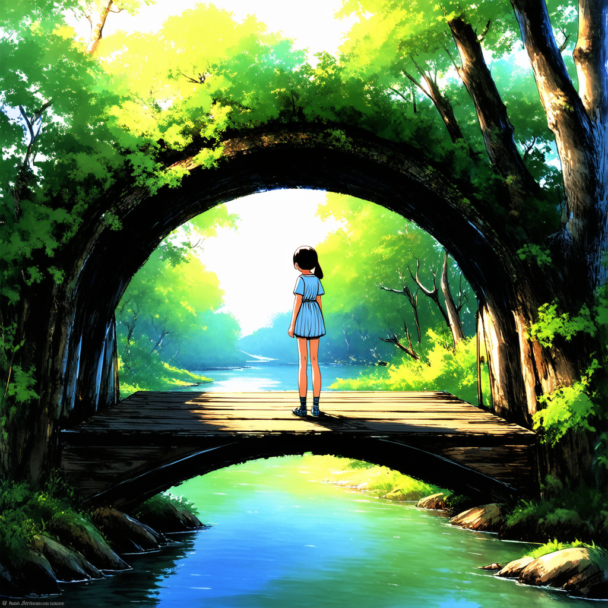
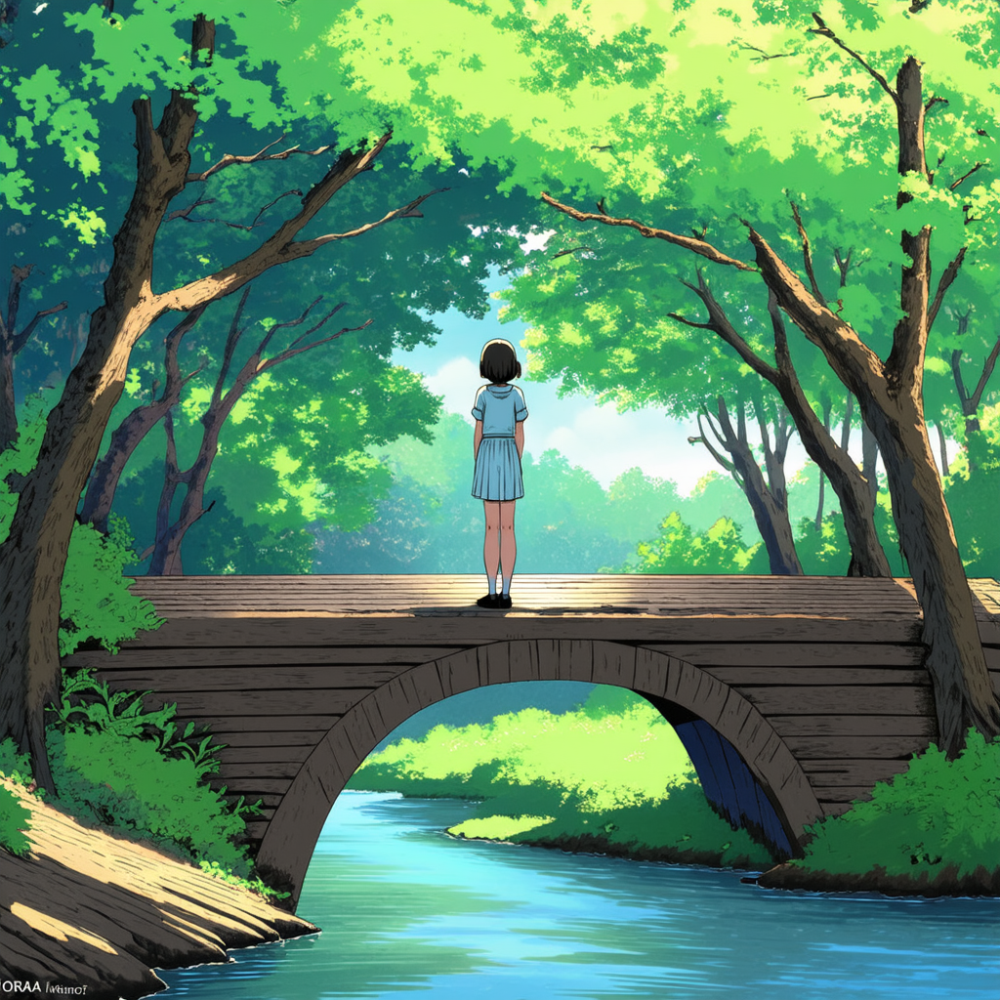

# 🎨 LoRA Fine-Tuning for Ghibli-Style with Stable Diffusion 3

This repository contains code and examples for fine-tuning **Stable Diffusion 3** using **LoRA** to achieve a **Studio Ghibli-style** visual aesthetic.

## ✨ Fine-Tuning Showcase

Below are examples comparing image generations from the **base model** and the **LoRA fine-tuned model**.

### 📌 Case 1: Floating Sandals and Dragonfly

**Prompt**:
*The Ghibli-style image captures a tranquil scene with a singular focus on a pair of pink sandals floating gently in the water. The background is composed of large, green lily pads that add to the serene atmosphere, suggesting a pond or a calm lake setting. A dragonfly hovers above the sandals, its wings spread as if it has just landed or is about to take off. This attention to detail and the use of soft colors are characteristic of Studio Ghibli's animation style, which often features whimsical elements and a strong connection to nature. For LoRA fine-tuning, one might emphasize the delicate interplay between the stillness of the water and the dynamic presence of the dragonfly, highlighting the contrast in movement and the harmonious blend of natural elements.*

**Base model output:**

**Fine-tuned model output:**

---

### 📌 Case 2: Girl looking into the distance on the wooden bridge

**Prompt**:
*The image presents a tranquil scene set in a lush, verdant forest. The focal point is a young girl standing on an old wooden bridge that arches over a calm river. She gazes into the distance with a contemplative expression, her figure rendered with soft, natural colors that blend seamlessly with the surrounding greenery. The bridge's rustic charm and the girl's simple attire evoke a sense of nostalgia and connection to nature.*

**Base model output:**

**Fine-tuned model output:**

---
